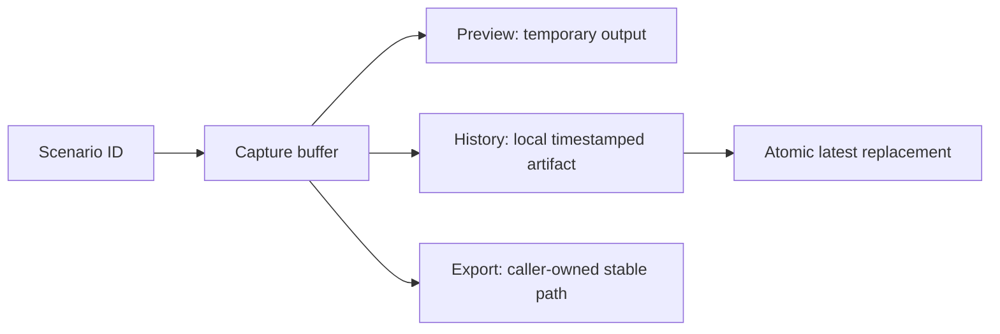
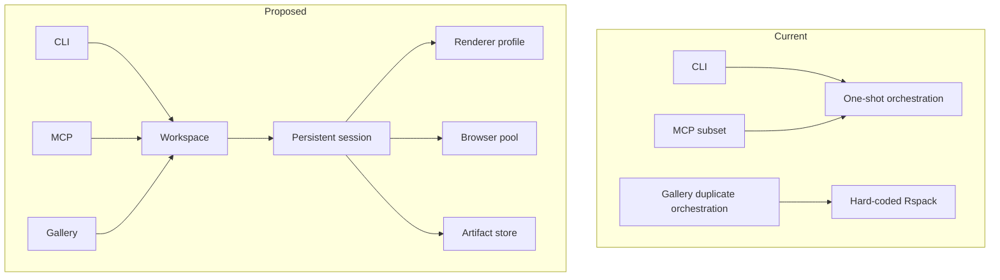

# Component Shot Interface Design

> Historical design input. The MCP recommendation was superseded on 2026-07-15 by one `capture_component_shot` tool with scenario/source targets, viewport/page/element areas, and explicit source or screenshot persistence. The workspace/session architecture remains current.

## Executive Summary

Component Shot currently exposes a one-shot capture transaction and lets CLI, MCP, and gallery reconstruct parts of that transaction independently. The replacement interface centers on three domain objects: a workspace that owns configuration and scenario identity, a session that owns reusable rendering resources, and explicit preview/history/export requests that make side effects clear. Existing one-shot functions remain compatibility wrappers while internal and agent-facing callers migrate to the new contracts.

## Domain And Consumers

Component Shot represents a deterministic renderable React state and the visual artifacts produced from it.

Its consumers are:

- scenario authors who need typed setup/provider state;
- agents using MCP to inspect or create UI in one operation;
- people using the gallery to inspect and discuss states;
- CLI users capturing or exporting images;
- package wrappers supplying project-specific renderer defaults.

The core is responsible for workspace discovery, scenario identity, rendering lifetime, browser capture, diagnostics, and artifact publication. Transports own argument parsing and presentation. Renderer implementations own bundler details.

## Proposed Public Interface

```ts
export type ComponentShotScenarioId = string & { readonly __componentShotScenarioId: unique symbol }

export type ComponentShotViewport = {
  width: number
  height: number
}

export type ComponentShotEnvironment = {
  colorScheme?: 'light' | 'dark'
  deviceScaleFactor?: number
  locale?: string
  reducedMotion?: 'no-preference' | 'reduce'
  timezoneId?: string
}

export type ComponentShotCaptureDefaults = {
  fullPage?: boolean
  selector?: string
  viewport?: ComponentShotViewport
  environment?: ComponentShotEnvironment
}

export type ComponentShotScenarioObject<ProviderState = unknown> = {
  id?: string
  title?: string
  description?: string
  tags?: string[]
  providerOptions?: ProviderState | false
  viewport?: ComponentShotViewport
  environment?: ComponentShotEnvironment
  capture?: Omit<ComponentShotCaptureDefaults, 'viewport' | 'environment'>
  setup?: () => ComponentShotMaybePromise<void>
  render: () => ComponentShotMaybePromise<ReactNode>
  afterRender?: () => ComponentShotMaybePromise<void>
  beforeScreenshot?: () => ComponentShotMaybePromise<void>
  rootStyle?: CSSProperties
  wrapper?: ComponentShotWrapper
}

export type ComponentShotDefinition<ProviderState> = {
  setup(value: ComponentShotAppSetup<ProviderState>): ComponentShotAppSetup<ProviderState>
  scenario(value: ComponentShotScenarioObject<ProviderState>): ComponentShotScenarioObject<ProviderState>
}

export function createComponentShot<ProviderState = unknown>(): ComponentShotDefinition<ProviderState>
export function defineComponentShotScenario<ProviderState = unknown>(
  scenario: ComponentShotScenarioObject<ProviderState>,
): ComponentShotScenarioObject<ProviderState>
export function defineComponentShotSetup<ProviderState = unknown>(
  setup: ComponentShotAppSetup<ProviderState>,
): ComponentShotAppSetup<ProviderState>
```

The helper makes the intended setup call site straightforward:

```tsx
export const componentShot = createComponentShot<AppShotState>()
export const scenario = componentShot.scenario

export default componentShot.setup({
  Provider: ({ children, options }) => (
    <AppProviders initialRoute={options?.route} querySeed={options?.querySeed}>
      {children}
    </AppProviders>
  ),
})
```

```tsx
import { scenario } from '../setup'

export default scenario({
  title: 'Pricing approval pending',
  tags: ['pricing', 'approval'],
  providerOptions: { route: '/rfps/1042', querySeed: pendingPricing },
  viewport: { width: 1280, height: 800 },
  render: () => <PricingReview />,
})
```

## Workspace And Session

```ts
export type ComponentShotWorkspaceOptions = {
  cwd?: string
  scenarioDir?: string
  screenshotsDir?: string
  setup?: string
  renderer?: ComponentShotRenderer
  defaults?: ComponentShotCaptureDefaults
  browserChannel?: string
}

export type ComponentShotScenarioInfo = {
  id: ComponentShotScenarioId
  name: string
  relativePath: string
  scenarioPath: string
  artifactKey: string
  historyCount: number
}

export interface ComponentShotWorkspace {
  readonly cwd: string
  readonly scenarioDir: string
  readonly screenshotsDir: string
  listScenarios(): Promise<ComponentShotScenarioInfo[]>
  createSession(): Promise<ComponentShotSession>
}

export type ComponentShotPreviewRequest = {
  scenario: string
  viewport?: ComponentShotViewport
  environment?: ComponentShotEnvironment
  selector?: string
  fullPage?: boolean
  output?: string
}

export type ComponentShotSaveRequest = ComponentShotPreviewRequest & {
  artifact: 'history'
}

export type ComponentShotExportRequest = ComponentShotPreviewRequest & {
  artifact: 'export'
  output: string
}

export type ComponentShotCaptureRequest =
  | ComponentShotPreviewRequest
  | ComponentShotSaveRequest
  | ComponentShotExportRequest

export type ComponentShotDiagnostic = {
  stage: 'discover' | 'build' | 'serve' | 'render' | 'capture' | 'artifact'
  severity: 'info' | 'warning' | 'error'
  message: string
  details?: string
}

export type ComponentShotCaptureResult = {
  scenarioId: ComponentShotScenarioId
  scenarioPath: string
  outputPath: string
  latestPath?: string
  historyPath?: string
  viewport: ComponentShotViewport
  durationMs: number
  diagnostics: ComponentShotDiagnostic[]
}

export interface ComponentShotSession {
  capture(request: ComponentShotCaptureRequest): Promise<ComponentShotCaptureResult>
  invalidate(paths?: string[]): Promise<void>
  close(): Promise<void>
}

export function createComponentShotWorkspace(
  options?: ComponentShotWorkspaceOptions,
): Promise<ComponentShotWorkspace>
```

The result intentionally contains no live URL. Live preview belongs to an owned session/gallery route, while one-shot capture returns durable information only.

## Renderer Contract

```ts
export type ComponentShotRenderProtocol = {
  readyGlobal: string
  errorGlobal: string
  metadataGlobal: string
}

export type ComponentShotRenderContext = {
  cwd: string
  scenarioPath: string
  setupPath?: string
  publicDir: string
  publicPath: string
  protocol: ComponentShotRenderProtocol
}

export interface ComponentShotRenderer {
  readonly name: string
  build(context: ComponentShotRenderContext): Promise<void>
}
```

All transports select a renderer through workspace configuration. MCP may select only named renderer profiles configured when the server starts. The trusted CLI retains a command renderer escape hatch.

## Artifact Contract

Preview, history, and export are distinct operations:



Artifact paths derive from the scenario's relative path within the scenario directory, not basename. Writes stage to a unique file and publish with atomic rename/copy semantics.

## Agent Interface

MCP uses separate tools for separate side-effect classes:

```ts
inspect_component_shot_workspace(args): WorkspaceStatus
list_component_shot_scenarios(args): ScenarioList
capture_component_shot(args): CaptureResult + image
preview_component_source(args): CaptureResult + image
capture_component_source(args): CaptureResult + image // explicit bounded scenario write
export_component_shot(args): CaptureResult + image
```

`capture_component_source` remains the one-call autonomous workflow: source is written under the configured scenario root, rendered, and returned as image content. Preview tools do not save history by default. Every result has structured content and every failure identifies a stage.

## Current Versus Proposed



## Compatibility And Migration

1. Add scenario metadata and helper functions without breaking existing exports.
2. Add workspace/session APIs and implement one-shot capture as a wrapper.
3. Move MCP to a persistent session and ephemeral capture defaults.
4. Move gallery discovery, renderer, capture, and history to workspace/session contracts.
5. Add `capture` subcommand while retaining root-level `--scenario` syntax.
6. Deprecate ready/error global customization, nested Rspack setup, dead result URL, and basename artifact lookup after compatibility shims.
7. Migrate legacy screenshot folders when the corresponding scenario is first saved; gallery may read both layouts during transition.

## Risks And Tradeoffs

- Session reuse can leak browser state. Use fresh contexts/pages while reusing only browser/compiler/server infrastructure.
- Project-wide watching can be expensive. Prefer renderer dependency graphs and exclude generated/vendor directories in fallback watchers.
- Blocking external network improves determinism but can break intentional live states. Allow explicit hosts and mocks.
- Rich scenario metadata can grow into configuration sprawl. Add only fields consumed consistently by CLI, MCP, and gallery.
- Renderer adapters add maintenance. Keep the core contract narrow and ship a small supported set.
