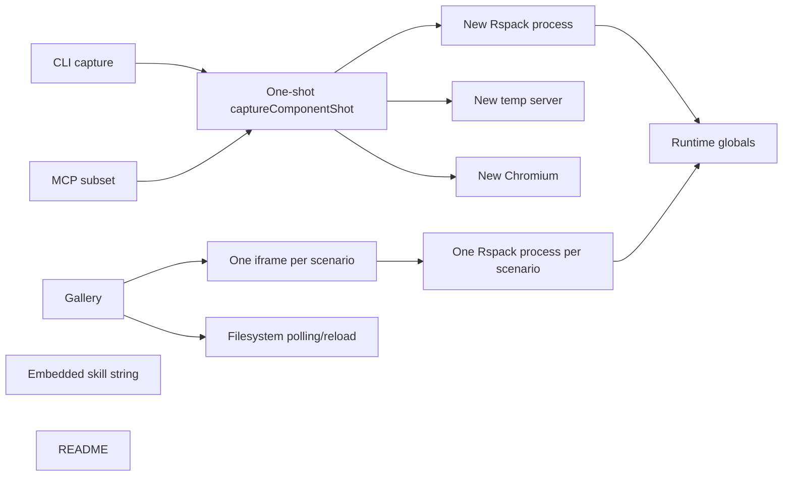

# Component Shot Architecture Review

> Historical audit input. The MCP tool-list recommendation was superseded on 2026-07-15 by one `capture_component_shot` tool; see the current README and packaged skill for its contract.

Component Shot has a strong product primitive - a small, reusable file that can place real React UI in a deterministic hard-to-reach state - and the current package proves the vertical path from scenario to PNG. Its overall architectural health is early-stage but promising. The single biggest issue is that CLI capture, MCP, and gallery are separate orchestration paths rather than clients of one long-lived workspace/render service. The highest-impact change is to build that shared service first: it would make imported component edits reliable, remove repeated compiler/browser startup, allow renderer adapters, and give every surface the same scenario, diagnostic, and artifact contract.

## Product Assessment

The core idea is worth preserving:

- Scenario files are source-controlled, agent-readable, and can render real app components with mocked providers.
- A scenario can represent intermediate, loading, error, empty, permission, modal, and responsive states that are expensive to reach in the real app.
- The same state can support design iteration, review, PR evidence, documentation, and later regression coverage.
- The provider hook is deliberately small and the demo confirms typed provider options work.
- Local loopback serving, path checks on gallery reads/deletes, strict TypeScript, package contents, and executable modes are solid foundations.

The current implementation is still shaped like a one-shot screenshot script. The product goal is closer to a lightweight UI workbench and render service. That distinction should drive the next architecture.

## Current Architecture



This shape creates four root problems:

1. Resource lifetime is invisible in the public API. The one-shot result returns a URL after closing it, and each call repeats fixed startup work.
2. Renderer policy is not shared. CLI has a build escape hatch, gallery hardcodes Rspack, and MCP exposes a subset.
3. Scenario identity and environment are fragmented across filenames, CLI flags, provider options, screenshot folders, and gallery logic.
4. The gallery is generated as strings inside a server module, so it cannot render or test its production frontend directly.

## Build A Shared Workspace And Render Session

**What**: Make every transport a client of one `ComponentShotWorkspace` and long-lived `RenderSession` instead of owning build/browser/server behavior.

**Why**: `captureComponentShot` creates and destroys a compiler process, temp server, and browser for every call. The gallery separately bundles every iframe and watches only the component-shot directory, so edits to imported app components stay stale. Watched changes clear all bundles and reload the page. See `STRUCTURAL-RENDER-SESSION-001`, `STRUCTURAL-RENDERER-PARITY-001`, and `API-DISPOSED-URL-001`.

**Proposed approach**:

```ts
export interface ComponentShotWorkspace {
  scenarios: ScenarioRegistry
  artifacts: ArtifactStore
  createSession(options?: SessionOptions): Promise<RenderSession>
}

export interface RenderSession extends AsyncDisposable {
  diagnostics(): AsyncIterable<RenderDiagnostic>
  getPreview(scenarioId: ScenarioId): Promise<PreviewHandle>
  capture(request: CaptureRequest): Promise<CaptureResult>
  invalidate(paths?: string[]): Promise<void>
}

export interface PreviewHandle {
  scenarioId: ScenarioId
  url: URL
}
```

The session should own:

- one watch-mode renderer/compiler with its real dependency graph;
- one loopback server;
- one browser process, with a fresh context or page per state for isolation;
- one diagnostic stream with build, runtime, console, and capture stages;
- explicit disposal and an operation deadline.

The one-shot API remains as a wrapper:

```ts
export async function captureComponentShot(request: CaptureRequest) {
  await using session = await openComponentShot(request.workspace)
  return session.capture(request)
}
```

MCP keeps a session warm for its process lifetime. Gallery uses the same session. CLI can use one-shot mode or a daemon/session for batches.

**What it unlocks**: Real component edits appear immediately, capture latency falls, browser/build errors become structured, batch viewport/state capture is cheap, and all surfaces behave consistently.

**Effort**: Epic.

**Tradeoffs**: Persistent sessions require invalidation and state-isolation rules. Fresh browser contexts plus a watched compiler preserve most isolation without paying full startup cost.

## Introduce A Renderer Adapter Boundary

**What**: Replace hard-coded Rspack policy and shell-command replacement with a versioned `RendererAdapter` used by every surface.

**Why**: The built-in config fixes SWC, CSS, assets, and a TinyMCE external. It cannot compose Sass, custom JSX transforms, framework plugins, or many real app pipelines. Gallery and MCP cannot use the CLI's escape hatch. This conflicts with the promise to render arbitrary UI. See `STRUCTURAL-RENDERER-PARITY-001` and `API-RSPACK-SETUP-001`.

**Proposed approach**:

```ts
export interface RendererAdapter {
  readonly name: string
  start(context: RendererContext): Promise<RendererSession>
}

export interface RendererSession extends AsyncDisposable {
  resolve(scenario: ScenarioRef): Promise<RenderedModule>
  diagnostics(): AsyncIterable<RenderDiagnostic>
  invalidate(paths?: string[]): Promise<void>
}
```

Provide:

- a maintained default adapter with neutral, documented behavior;
- a Vite adapter that can reuse a project's config/plugins;
- the existing Rspack adapter behind the same contract;
- named, startup-configured build profiles for MCP;
- a trusted CLI-only command adapter for unusual projects.

Do not expose arbitrary model-authored shell commands through MCP. The MCP server should select an allowlisted profile configured at startup.

**What it unlocks**: The gallery and MCP can render the same real components as CLI, projects can reuse their CSS/alias/plugin pipeline, and renderer evolution no longer changes scenario contracts.

**Effort**: Large.

**Tradeoffs**: More adapters mean compatibility maintenance. Keep the interface narrow and treat raw bundler config access as adapter-specific, not part of the core package contract.

## Make Scenario State First Class

**What**: Turn a scenario from a render callback plus out-of-band flags into a typed, stable definition shared by the registry, renderer, gallery, MCP, and artifact store.

**Why**: The current scenario omits title/group/tags, viewport and browser environment, capture target, and artifact identity. Screenshot history uses basenames while gallery IDs use relative paths; nested duplicate names collide and `saveName` artifacts can disappear. Provider option types are manually repeated. See `API-SCENARIO-CONTRACT-001` and `API-ARTIFACT-IDENTITY-001`.

**Proposed approach**:

```ts
const workspace = defineComponentShot<ProviderState>({
  render: ({ children, state }) => (
    <AppProviders route={state.route} querySeed={state.querySeed}>
      {children}
    </AppProviders>
  ),
  defaults: {
    environment: { locale: 'en-AU', timezoneId: 'Australia/Melbourne' },
    viewport: { width: 1280, height: 800 },
  },
})

export const scenario = workspace.defineScenario
export default workspace.setup
```

```ts
export default scenario({
  id: 'rfp/review/pricing-pending',
  title: 'Pricing pending approval',
  tags: ['rfp', 'approval', 'pricing'],
  state: { route: '/rfps/1042', querySeed: pricingPending },
  viewport: { width: 1440, height: 900 },
  render: () => <PricingReview />,
})
```

Use path-derived IDs by default and explicit IDs only when stability across moves matters. Artifact paths and metadata must use `ScenarioId`, never basename. CLI flags can override scenario defaults, but precedence must be explicit and reported in the result.

Keep one file per important state as the default because it is simple for agents and code review. Add state collections only if real use shows that closely related variants become noisy.

**What it unlocks**: Reproducible states across every surface, typed provider setup without repeated generics, grouping/search in the gallery, batch capture, and reliable artifact history.

**Effort**: Large.

**Tradeoffs**: A richer public contract needs migration and careful defaults. Avoid turning scenarios into a Storybook-sized parameter system; add only metadata consumed by real workflows.

## Redesign Gallery As A Workbench

**What**: Replace the all-live-card page plus separate generated detail page with one production frontend organized around a selected scenario and an optional overview.

**Why**: Every card eagerly loads a live iframe and creates a bundle. The detail view has no viewport, zoom, capture, export, refresh, console, or error controls. History cannot be created from the gallery. Destructive actions are more prominent than the core capture workflow, and the current full-height update clips the iframe. The visual scenario tests a duplicate facade. See `ERROR-GALLERY-DIAGNOSTICS-001`, `CODE-DETAIL-IFRAME-001`, `STRUCTURAL-GALLERY-GOD-FILE-001`, and `TEST-GALLERY-FACADE-001`.

**Proposed approach**:

```text
+--------------------------------------------------------------------------------+
| Workspace | renderer status | viewport | zoom | background | reload | Capture   |
+----------------------+-----------------------------------------+----------------+
| Scenarios            | Live canvas                             | Inspector      |
| search / tags        |                                         | State          |
| grouped state list   |          selected scenario              | History        |
|                      |                                         | Diagnostics    |
| Grid overview        |                                         | Console        |
+----------------------+-----------------------------------------+----------------+
```

Recommended behavior:

- Default to a single selected live iframe; use `latest.png` or lazy static thumbnails in Grid overview.
- Add viewport presets and exact width/height, fit/100% zoom, background swatches, reload, and open-in-new-tab.
- Add a visible build/runtime diagnostic panel with retry and copy-log controls.
- Add `Capture` for ephemeral inspection and `Save artifact`/`Export` for durable output.
- Keep View and History as full-height views or inspector tabs; add current-versus-previous comparison.
- Show effective scenario metadata, provider/setup path, renderer profile, viewport, and capture duration.
- Make source deletion opt-in edit mode and recoverable; default remote binds to read-only.
- Build the frontend as real components with injected API clients, then render those components in Component Shot scenarios.

**What it unlocks**: Faster human review, actionable failures, responsive design iteration, self-dogfooding visual tests, and an obvious path from live state to PR/docs image.

**Effort**: Large.

**Tradeoffs**: A frontend build adds structure to a currently dependency-light server. That cost is justified because the gallery is now a primary product surface and string templates are blocking testability and iteration.

## Make Agent Integrations A Product Surface

**What**: Treat install, workspace discovery, MCP tools, and the skill as one maintained agent experience.

**Why**: The documented browser bootstrap fails in a fresh pnpm consumer, bare binary examples are fragile, MCP calls can escape roots, read-like capture writes history, schemas are not runtime enforced, and the skill covers only a shallow happy path. See `API-INSTALL-BOOTSTRAP-001`, `SECURITY-MCP-ROOT-CONFINEMENT-001`, `API-MCP-CONTRACT-001`, `API-MCP-PERSISTENCE-001`, and `API-SKILL-WORKFLOW-001`.

**Proposed approach**:

Add agent-friendly CLI commands with JSON output:

```text
component-shot init
component-shot doctor --json
component-shot browser install chromium
component-shot mcp install --client codex
component-shot skill install --agent codex
component-shot list --json
component-shot capture <scenario-id> --json
component-shot export <scenario-id> --output docs/images/example.png
```

Recommended MCP surface:

```text
inspect_component_shot_workspace   read-only setup/browser/renderer diagnostics
list_component_shot_scenarios     read-only IDs, titles, tags, viewports
render_component_shot             ephemeral existing-state screenshot
preview_component_source          ephemeral virtual source, no repo write
create_component_shot_scenario    explicit bounded write
export_component_shot             explicit durable artifact write
```

The server description/instructions should explain that Component Shot is appropriate when an agent needs to iterate UI quickly, render hard-to-reach intermediate states, mount a real component with mocked providers, or create a deterministic PR/docs screenshot without navigating the application. Tool annotations must distinguish read-like preview from writes. Results should include structured scenario ID, effective viewport/environment, image dimensions, duration, artifact paths, warnings, and stage-coded diagnostics.

Ship one canonical skill directory rather than embedding Markdown in TypeScript. Suggested skill references:

- `references/setup-providers.md`: theme/router/query/auth/i18n/portal recipes;
- `references/scenario-states.md`: loading/error/empty/intermediate and real-component patterns;
- `references/iteration.md`: MCP versus gallery versus CLI decision flow;
- `references/troubleshooting.md`: browser, bundler, clipping, readiness, and monorepo fixes;
- `references/artifacts.md`: local history versus committed PR/docs exports.

**What it unlocks**: Reliable setup by agents, safer tool calls, fewer unnecessary repository writes, stronger activation for the product's best use cases, and less prompt-specific knowledge.

**Effort**: Medium to large.

**Tradeoffs**: Client-specific config installers need maintenance. Keep the core skill content portable and isolate each client writer behind a small adapter.

## Define Deterministic And Bounded Execution

**What**: Make offline determinism, network policy, deadlines, readiness, and cleanup explicit runtime contracts.

**Why**: The current HTML fetches a remote font, browser context depends on host defaults, runtime/host readiness names can diverge, timeout is partial, and arbitrary rendered code has unrestricted network reach. Process/server cleanup can hide primary errors. See `STRUCTURAL-DETERMINISTIC-CAPTURE-001`, `API-READINESS-PROTOCOL-001`, `ERROR-CAPTURE-DEADLINE-001`, `SECURITY-CAPTURE-NETWORK-001`, and `ERROR-RUNTIME-BOUNDARIES-001`.

**Proposed approach**:

- Default to no external network; allow capture origin plus explicit mocks/hosts.
- Remove remote/default typography from the runtime shell.
- Pin locale, timezone, device scale, color scheme, reduced motion, and animation policy.
- Replace configurable globals with typed parent/runtime messages containing `ready`, `error`, and diagnostics.
- Give every operation one deadline and AbortSignal; terminate child process trees on timeout.
- Capture to an immutable buffer, then atomically publish history/latest/export artifacts.
- Preserve the primary exception and attach cleanup failures rather than replacing it.

**What it unlocks**: Stable pixels across machines, safe mocked states, predictable agent timeouts, better error recovery, and trustworthy artifact provenance.

**Effort**: Large.

**Tradeoffs**: Default-deny network and disabled animations can surprise scenarios that intentionally test live traffic or motion. Make those choices explicit scenario overrides and report the effective profile.

## Build A Release Test Architecture

**What**: Make installed runtime behavior, not compilation, the release invariant.

**Why**: No behavioral tests exist, a fake gallery fixture provides false confidence, and fresh-consumer and Node engine problems are invisible in the repository demo. See `TEST-ARCH-INTEGRATION-COVERAGE-001`, `TEST-GALLERY-FACADE-001`, and `API-NODE-ENGINE-001`.

**Proposed approach**:

1. Unit tests: option normalization, scenario IDs, setup precedence, path confinement, artifact policy, MCP schemas, platform path parsing.
2. Runtime contract tests: lifecycle ordering, provider opt-in/out, async readiness, render errors, network policy, deadline/cancellation, atomic saves.
3. Renderer fixtures: plain React/CSS, aliases, CSS modules/Sass through adapters, monorepo dependency roots, imported component invalidation.
4. Gallery HTTP/UI tests: empty workspace, first scenario creation, selected render, build error, viewport controls, capture/history, read-only mutation policy.
5. MCP stdio tests: list/inspect/render/create/export, structured errors, allowed-root enforcement, no implicit persistence.
6. Packed consumer tests: install tarball with pnpm/npm, run documented browser bootstrap, verify binaries/exports, capture one provider-backed state.
7. CI matrix: exact supported Node majors and at least Linux plus Windows path-policy coverage.

Use Component Shot itself for visual states of the real gallery frontend, but keep a small Playwright end-to-end layer for server/browser integration.

**What it unlocks**: Confident refactoring of the core architecture, reliable publishing, accurate compatibility claims, and self-dogfooding without duplicate fixtures.

**Effort**: Large.

**Tradeoffs**: Browser and packed-install tests cost time. Keep most tests below the browser boundary and reserve a small deterministic fixture set for the release gate.

## Separate Iteration History From Durable Exports

**What**: Model preview, local history, approved snapshot, and PR/docs export as distinct artifact intents.

**Why**: MCP saves every capture by default, history paths can collide, and docs show only temporary output or ignored history. See `API-MCP-PERSISTENCE-001`, `API-ARTIFACT-IDENTITY-001`, `ERROR-ARTIFACT-RACE-001`, and `CODE-ARTIFACT-EXPORT-001`.

**Proposed approach**:

```ts
type ArtifactIntent =
  | { kind: 'preview' }
  | { kind: 'history' }
  | { kind: 'approved'; label?: string }
  | { kind: 'export'; outputPath: string }
```

Preview returns image content and temporary metadata without repository writes. History is local and ignored. Approved artifacts are stable scenario-ID records for comparison. Export writes exactly the requested durable path and can return a Markdown snippet for PR/docs use.

**What it unlocks**: Fast clean iteration, useful history rather than noise, trustworthy comparisons, and a first-class arbitrary screenshot workflow.

**Effort**: Medium.

**Tradeoffs**: More explicit operations add vocabulary, but they make side effects and artifact ownership obvious to agents and humans.

## Target Module Layout

```text
src/
  contract/
    scenario.ts
    workspace-config.ts
    capture.ts
    diagnostics.ts
  workspace/
    discover.ts
    registry.ts
    scenario-store.ts
  session/
    render-session.ts
    browser-pool.ts
    deadline.ts
  renderers/
    rspack/
    vite/
    command/
  artifacts/
    store.ts
    identity.ts
    export.ts
  gallery/
    server.ts
    api.ts
    app/
  mcp/
    server.ts
    schemas.ts
    tools.ts
  cli/
    commands/
  skill-assets/
    component-shot/
```

Dependency direction should be inward: CLI, MCP, and gallery depend on workspace/session contracts; renderer, browser, filesystem, and HTTP implementations sit behind those contracts. No transport should reimplement setup discovery, scenario identity, artifact paths, or capture defaults.

## Recommended Sequence

1. **Correctness gate**: fix iframe sizing; align Node engines; add package-owned browser install; confine MCP paths; fix/reject readiness overrides; default MCP preview to no save; add smoke tests.
2. **Core boundary**: extract scenario registry, artifact identity/store, renderer adapter, and `RenderSession`; move one-shot capture onto it.
3. **Session adoption**: move MCP and gallery to the shared persistent session with dependency-aware invalidation and structured diagnostics.
4. **Scenario contract**: add typed workspace/scenario helpers, metadata, environment defaults, and migration for history IDs.
5. **Gallery workbench**: build the real frontend, selected-canvas workflow, inspector, capture/export, and comparison.
6. **Agent productization**: ship init/doctor/MCP installer and the canonical comprehensive skill bundle.

This sequence fixes active blockers early while working toward the ideal architecture rather than layering more behavior into the current monoliths.
